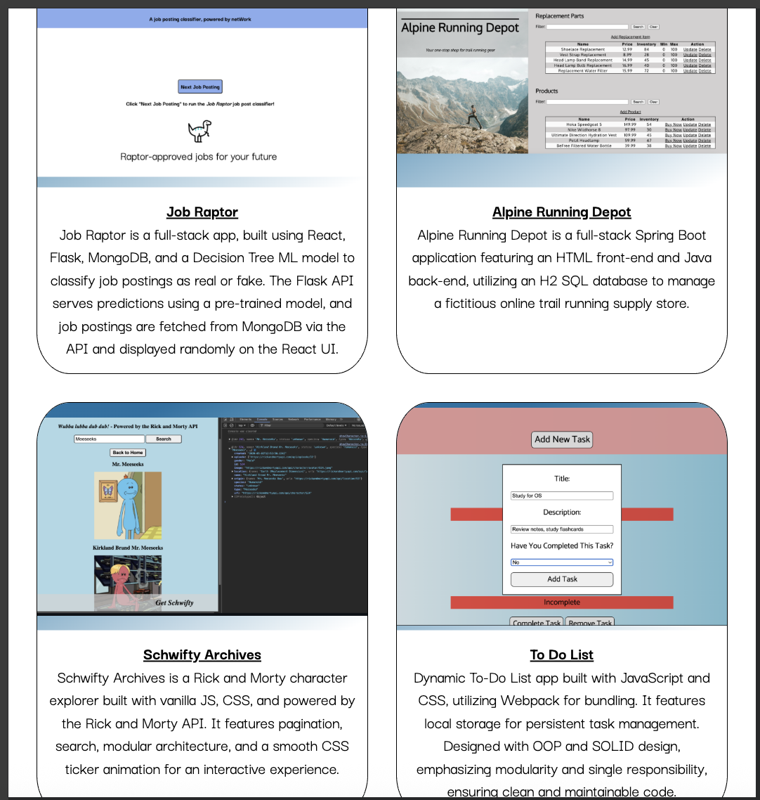

# Portfolio Homepage
## Project 13: Homepage

## Description: 
Welcome to my thirteenth web development project! This is part of my coursework in The Odin Project, a free, open-source curriculum to learn fullstack web development! 

This project is a basic portfolio homepage, solely built using HTML / CSS with an emphasis on responsive web design. I hope you enjoy! 

## Links:
The full challenge description can be found here: https://www.theodinproject.com/lessons/node-path-advanced-html-and-css-homepage

## Screenshots: 
<u>Laptop View</u>

<u>Tablet View</u>

<u>Phone View</u>

